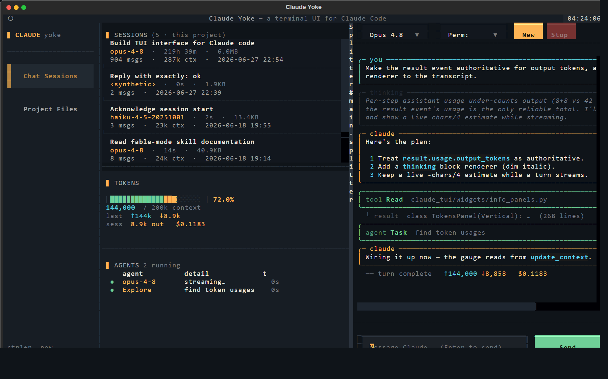

# Claude Yoke — a Terminal UI (TUI) for Claude Code

**Claude Yoke** is a multi-pane **terminal UI for [Claude Code](https://docs.anthropic.com/en/docs/claude-code)**,
Anthropic's AI coding agent. It drives the real `claude` CLI as its engine (via
streaming JSON), so you get Claude Code's actual tools, MCP servers, permissions
and session storage — wrapped in a fast, keyboard- and mouse-friendly dashboard
in your terminal.

Think of it as the **yoke** — the control column you grip to fly the agent:
watch your token budget on a live fuel gauge, see running subagents as status
lights, browse and resume past sessions, and edit your project files without
leaving the terminal.



> Keywords: Claude Code TUI · terminal UI for Claude · Claude Code dashboard ·
> AI coding agent terminal client · Textual Python TUI · Claude CLI wrapper ·
> token usage monitor · agent cockpit.

## Why Claude Yoke?

Claude Code is excellent in a bare terminal, but a single scrolling log hides the
things you actually want at a glance: how much context you've burned, which
subagents are running, and which past session to resume. Claude Yoke puts those
on dedicated instruments while keeping the **real** Claude Code engine underneath
— no API re-implementation, no lost features.

## Features

- **Live token gauge** — a context-window fuel bar with authoritative token and
  cost numbers from the CLI's own `result` events, plus a live estimate while a
  turn streams.
- **Agents panel** — the in-flight turn and any `Task` subagents shown as status
  lights (● running / ✓ done) with elapsed time.
- **Session browser** — every session for the current project, with title, model,
  duration, size, message count and context tokens; select one to replay its
  transcript and **resume** the conversation.
- **Project file editor** — a directory tree of the project (build/VCS noise
  filtered out) with a built-in modal editor (Ctrl+S to save).
- **Full transcript rendering** — text, thinking, tool calls and tool results,
  identical for live and replayed sessions.
- **Tool-permission prompts** — when Claude needs approval for a tool, a dialog
  bubbles up (Allow once / Allow for session / Deny) instead of the request
  being silently auto-denied.
- **Model & permission switching** — dropdowns mapped straight onto
  `claude --model` / `claude --permission-mode`.
- **Distinctive "Cockpit" theme** — a deliberate instrument-panel visual identity
  (see below), not a default dark theme.
- **Emoji-free, font-safe** — uses only glyphs in common terminal fonts so it
  renders cleanly everywhere.

## Layout

```
┌────────────┬──────────────────┬───────────────────────────┐
│ Activity   │ Sidebar (switch) │  Main Chat  (right half)   │
│ Bar        │  SESSIONS        │   model / permission bar   │
│            │   list+metadata  │   transcript               │
│ Chat       │  (or project     │   (text · thinking ·       │
│ Sessions   │   file tree)     │    tool calls · results)   │
│ Project    ├──────────────────┤                            │
│ Files      │  TOKENS (est.)   │                            │
│ (extensible)├─────────────────┤   ──────────────────────   │
│            │  AGENTS running  │   > message…      [Send]   │
└────────────┴──────────────────┴───────────────────────────┘
```

* **Activity bar (left pane).** A vertical stack of buttons, driven by an
  extensible registry (`widgets/activity_bar.py → VIEWS`). Ships with **Chat
  Sessions** and **Project Files**; adding another destination is one entry plus
  a matching widget in the sidebar's `ContentSwitcher`.
* **Sidebar.** Switches between the **session browser** and the **project file
  tree** (click any file to edit it in a modal; Ctrl+S saves, Esc closes).
* **Tokens panel.** Live context-window gauge, last-turn ↑/↓, cumulative session
  output, and cost.
* **Agents panel.** The in-flight turn plus any `Task` subagents.
* **Main chat (right half).** Model + permission-mode selectors, the transcript,
  and the composer.

**Resizing.** Drag the thin vertical divider between the sidebar column and the
chat to rebalance the split (it lights up amber on hover).

### Visual identity — "Cockpit"

The app is treated as an **instrument panel for driving an AI coding agent**, and
colour carries meaning rather than decoration (defined in `theme.py`):

* **amber `#FFB454`** — the agent: brand, active nav, and `claude`'s messages
* **ice `#56C7D4`** — context the agent has *consumed* (the token readouts, `you`)
* **nominal green `#6FCF97`** — status lights and tool telemetry
* **caution/danger** — gauge load zones and errors
* a cool slate **hull `#0F1419`** behind warm off-white labels

The **signature** is the token gauge: a zone-coloured fuel bar (green → amber →
red across its length, with sub-cell precision and `▏ ▕` end-caps). Section
labels are quiet muted eyebrows with a small amber index tab `▍`, so the *data*
is what lights up, not the chrome. The UI is deliberately emoji-free: it uses only
glyphs present in common terminal fonts (box-drawing, arrows, `●✓✗`, block bars)
so it renders cleanly everywhere, including in the exported SVG/PNG above.

## Requirements

* **Python 3.10+**
* The **`claude` CLI** on `PATH` (or point `CLAUDE_TUI_CLI` at it). Browsing
  sessions and editing files works without it; only *sending* needs it.
* [Textual](https://textual.textualize.io/) (installed automatically below).

## Install & run

```powershell
# Windows (PowerShell) — creates .venv and installs deps on first run
.\run.ps1
```

> On Windows, run it from a **PowerShell** prompt with the leading `.\`. Typing
> `run.ps1` in **cmd.exe** opens the file in Notepad instead of executing it.
> From cmd: `powershell -ExecutionPolicy Bypass -File run.ps1`.

```bash
# or manually, any platform
python -m venv .venv
.venv/Scripts/python -m pip install -r requirements.txt   # .venv/bin on macOS/Linux
.venv/Scripts/python -m claude_tui
```

## Keybindings

| Key | Action |
| --- | --- |
| `Enter` | Send the message |
| `Ctrl+N` | New session |
| `Ctrl+R` | Reload the sessions list |
| `Esc` | Stop the current turn |
| `Ctrl+Q` | Quit |
| `Ctrl+S` | Save (in the file editor) |

The **model** and **permission-mode** dropdowns map straight onto
`claude --model` / `claude --permission-mode`. In the default mode, when Claude
wants to use a tool that needs approval a **permission dialog pops up** —
**Allow once** (`a`), **Allow for session** (`s`), or **Deny** (`d`/`Esc`).
Pick `acceptEdits` to let Claude edit files without asking, or
`bypassPermissions` to never be prompted.

## How it works

Each turn drives the CLI in **bidirectional** stream-json mode:

```
claude --input-format stream-json --output-format stream-json --verbose \
       --permission-prompt-tool stdio \
       [--resume <session-id>] [--model <model>] [--permission-mode <mode>]
```

`core/claude_client.py` spawns that subprocess with `asyncio`, writes the user's
turn to its **stdin** as a stream-json `user` message (keeping stdin open), and
reads stdout line by line yielding each JSON event. Because stdin stays open, the
CLI can ask to use a tool mid-turn: it sends a `control_request`, the app pops a
`PermissionScreen`, and the answer goes back as a `control_response` — so
**questions actually bubble up** instead of being silently auto-denied. `app.py`
dispatches the rest to the panels: `system/init` captures the session id (for
`--resume`), `assistant` blocks render text / thinking / tool calls and feed the
token gauge, `Task` tool calls populate the Agents panel, and `result` commits
authoritative tokens and cost.

## Project structure

```
claude_tui/
  app.py              # App: layout, wiring, the streaming turn loop
  config.py           # paths, CLI discovery, model/permission lists, pricing
  theme.py            # the "Cockpit" palette + Textual theme
  render.py           # Rich renderables shared by live + replayed transcripts
  core/
    claude_client.py  # async streaming wrapper around the claude CLI
    sessions.py       # index/parse ~/.claude session transcripts
  widgets/
    activity_bar.py   # extensible left-pane button registry
    sessions_list.py  # sessions browser with metadata
    files_tree.py     # project directory tree
    info_panels.py    # Tokens + Agents panels
    chat.py           # toolbar + transcript + composer
    editor.py         # modal file editor
    permission.py     # modal tool-permission prompt (allow / deny)
    splitter.py       # draggable divider to resize the panes
  styles.tcss         # layout + theme
tests/
  smoke_test.py       # headless: compose, view switching, event handling
  stream_probe.py     # real subprocess streaming against a fake CLI
  perm_probe.py       # tool-permission control protocol (allow/deny/session)
  fake_cli.py         # stand-in CLI emitting stream-json events
  fake_perm_cli.py    # stand-in CLI that drives the permission control protocol
  layout_probe.py     # asserts pane geometry, writes screenshot.svg
  showcase.py         # drives a realistic state, writes the docs screenshot
```

## Tests

```powershell
.venv/Scripts/python tests/smoke_test.py
.venv/Scripts/python tests/stream_probe.py
.venv/Scripts/python tests/perm_probe.py
.venv/Scripts/python tests/layout_probe.py
```

None of the tests call the real API.

## Extending the activity bar

```python
# widgets/activity_bar.py
VIEWS = [
    ViewDef("sessions", "Chat Sessions"),
    ViewDef("files",    "Project Files"),
    ViewDef("settings", "Settings"),   # 1) add here
]
```

```python
# app.py compose(), inside the ContentSwitcher  — 2) mount a widget with the same id
yield SettingsView(id="settings")
```

That's it — the bar builds its buttons from `VIEWS` and the switcher routes to
the matching id.

## FAQ

**Is this an official Anthropic project?** No — it's an independent open-source
client that wraps the official `claude` CLI. "Claude" and "Claude Code" are
Anthropic products.

**Does it re-implement the Claude API?** No. It shells out to the real `claude`
CLI, so tools, MCP servers, permissions and session files are exactly Claude
Code's.

**Which platforms?** Anywhere Python and Textual run — Windows, macOS and Linux.
